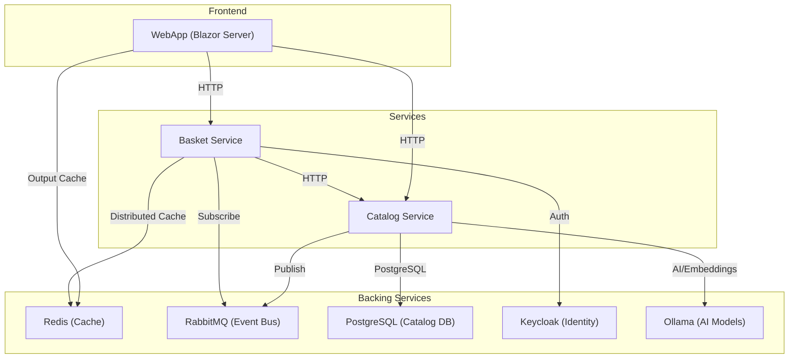

# eshop-distributed

A distributed e-commerce reference application built with **.NET Aspire**, demonstrating modern microservices architecture, cloud-native patterns, and Generative AI integration.

## Overview

This project showcases a distributed system implementation using .NET Aspire to orchestrate multiple microservices and backing stores. It includes a Blazor Server frontend, backend APIs for Catalog and Basket, and integrates with various infrastructure services like Redis, RabbitMQ, Keycloak, and Ollama for AI capabilities.

## Architecture

The system consists of the following components:



### Components

- **AppHost**: The .NET Aspire orchestrator project that manages the lifecycle and configuration of all services and containers.
- **ServiceDefaults**: Shared project containing default configurations for OpenTelemetry, Health Checks, and Service Discovery.
- **WebApp**: A **Blazor Server** application serving as the frontend user interface.
- **Catalog**: Microservice responsible for managing product data, utilizing **PostgreSQL** for storage and **Ollama** for AI-powered features (embeddings/text generation).
- **Basket**: Microservice for managing user shopping carts, utilizing **Redis** for performant caching and **Keycloak** for identity management.

### Infrastructure & Backing Services

- **App Host Orchestration**: Automatically provisions and configures containers for development.
- **PostgreSQL**: Relational database for the Catalog service.
- **Redis**: Distributed cache and output cache provider.
- **RabbitMQ**: Message broker for asynchronous event-driven communication.
- **Keycloak**: Identity and Access Management (IAM) solution.
- **Ollama**: Local LLM provider hosting `llama3.2` and `all-minilm` models for AI features.
- **SQL Server**: Available as an additional database option.

## Prerequisites

Ensure you have the following installed to run the solution:

- **.NET 8 SDK** (or later)
- **Docker Desktop** (Required for containers)
- **Visual Studio 2022** (Version 17.9+ with .NET Aspire workload) OR **VS Code** with C# Dev Kit.

## Getting Started

1.  **Clone the repository**:
    ```bash
    git clone https://github.com/datngw/dotnet-aspire.git
    cd dotnet-aspire
    ```

2.  **Trust the HTTPS development certificate**:
    ```bash
    dotnet dev-certs https --trust
    ```

3.  **Run the application**:
    Navigate to the `AppHost` directory and run:
    ```bash
    cd AppHost
    dotnet run
    ```
    Or simply press `F5` in Visual Studio with `AppHost` set as the startup project.

4.  **Access the Dashboard**:
    The **.NET Aspire Dashboard** will launch automatically, providing a central view of all running services, logs, traces, and metrics. You can access the **WebApp** and other service endpoints directly from there.

## Project Structure

```text
eshop-distributed/
├── AppHost/                # .NET Aspire Orchestrator
│   └── Program.cs          # Service registration & orchestration
├── ServiceDefaults/        # Shared defaults (OpenTelemetry, HealthChecks)
│   └── Extensions.cs       # Cross-cutting concerns configuration
├── WebApp/                 # Blazor Server Frontend
│   ├── ApiClients/         # Typed HTTP clients for backend services
│   ├── Components/         # Blazor UI components & pages
│   ├── Services/           # Frontend business logic
│   └── wwwroot/            # Static assets (CSS, JS, images)
├── Catalog/                # Product Service (Minimal API)
│   ├── Data/               # Database context & migrations (PostgreSQL)
│   ├── Endpoints/          # API route definitions
│   ├── Models/             # Domain entities & DTOs
│   └── Services/           # Business logic & AI integration
└── Basket/                 # Basket Service (Minimal API)
    ├── Endpoints/          # API route definitions
    ├── EventHandlers/      # RabbitMQ event consumers
    ├── Models/             # Domain entities (Redis)
    └── Services/           # Business logic
```

## References

- **Course**: [.NET Aspire & GenAI: Develop Distributed Architectures](https://www.udemy.com/course/net-aspire-and-genai-develop-distributed-architectures)